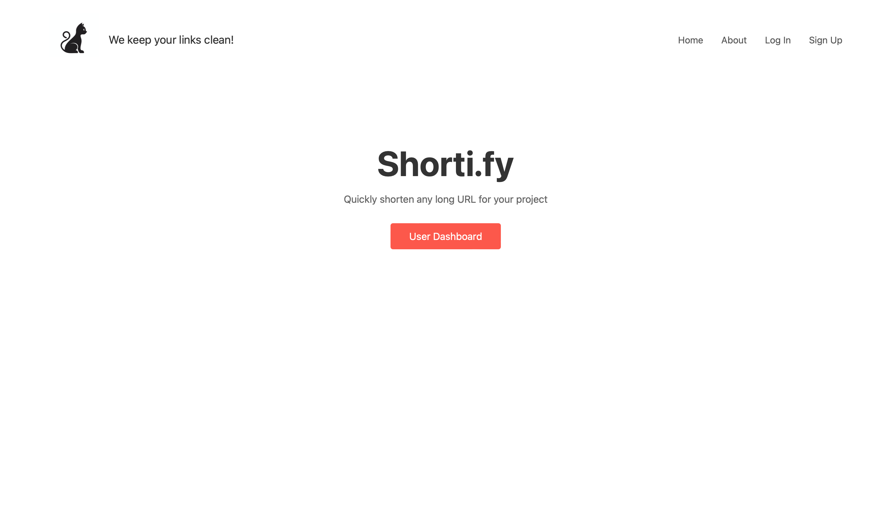
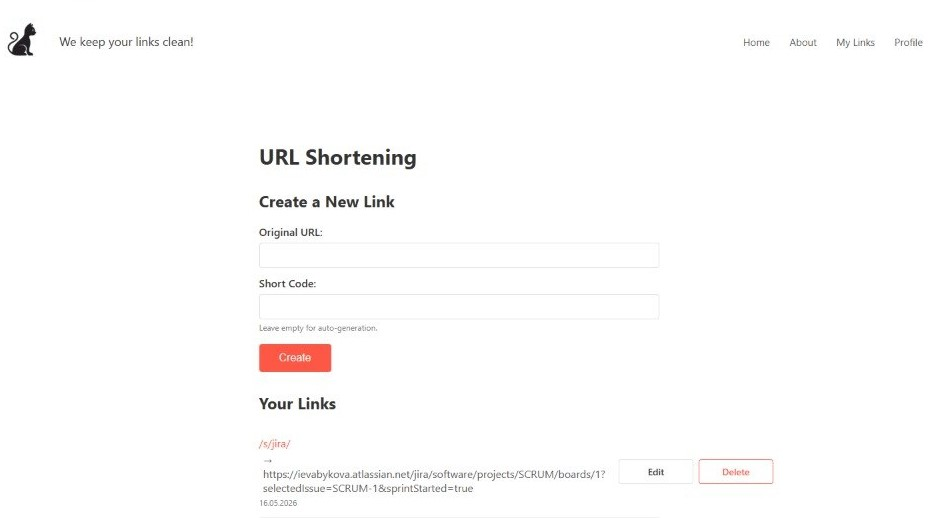

# Shorti.fy — URL Shortener (Django)

Shorti.fy is a simple and fast URL shortening service built with **Python + Django**.  
It allows users to create short, clean links and manage them in a personal dashboard.

---

## Preview




---

## Features

- User registration and authentication (sign up / log in / log out)
- Edit profile information (username, email)
- Change password
- Create short links from long URLs
- Automatic short code generation (if left empty)
- View, edit and delete your links
- Form validation & error handling
- Clean minimalistic CSS interface
- Instant redirection via `/s/<code>/`
- 18 automated unit tests (Django TestCase)

---

## Tech Stack

- **Python 3.11+**
- **Django 5.x**
- HTML, CSS
- SQLite (for development)

---

## Project Structure

```
link-shortener/
├── links/          # Models, views, forms, tests
├── shortener/      # Project settings and URLs
├── templates/      # HTML templates
├── static/         # CSS, images
├── manage.py
├── requirements.txt
└── .gitignore
```

---

## How to Run Locally

### 1. Clone the repository
```bash
git clone https://github.com/eva-maker/link-shortener.git
cd link-shortener
```

### 2. Create a virtual environment
```bash
python -m venv venv
source venv/bin/activate      # macOS / Linux
venv\Scripts\activate         # Windows
```

### 3. Install dependencies
```bash
pip install -r requirements.txt
```

### 4. Run migrations
```bash
python manage.py migrate
```

### 5. Start the development server
```bash
python manage.py runserver
```

Open your browser at: **http://127.0.0.1:8000/**

---

## Run Tests

```bash
python manage.py test links
```

Expected output: `Ran 18 tests — OK`

---

## Author
Author:   Yeva Bykova
GitHub:   https://github.com/eva-maker
Telegram: @evb_it

